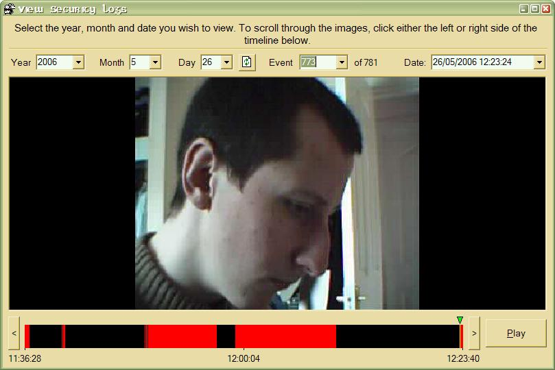



## Security Camera v1\.0 \(Final Build\)

### Description

This will detect any motion between screenshots taken from a webcam and if so, saves the picture as a jpeg showing the before/after/motion snapshots as a single file. You can customise the amount of detail checked per frame, the frame rate and the colour tolerance as well as view the logged snapshots as a slideshow with a time line graph to show you when the shots were taken in the day and the timeline now only shows the range from the first to last log for the day instead of the entire day. You can also more easily select a screenshot either by selecting the event number or the date/time from a combo box (see screenshot below).
 
### More Info
 

             |
---                |---
**Submitted On**   |2006-05-26 12:35:30
**By**             |[Eric O'Sullivan](https://github.com/Planet-Source-Code/PSCIndex/blob/master/ByAuthor/eric-o-sullivan.md)
**Level**          |Advanced
**User Rating**    |4.9 (79 globes from 16 users)
**Compatibility**  |VB 6\.0
**Category**       |[Complete Applications](https://github.com/Planet-Source-Code/PSCIndex/blob/master/ByCategory/complete-applications__1-27.md)
**World**          |[Visual Basic](https://github.com/Planet-Source-Code/PSCIndex/blob/master/ByWorld/visual-basic.md)
**Archive File**   |[Security\_C1997045262006\.zip](https://github.com/Planet-Source-Code/eric-o-sullivan-security-camera-v1-0-final-build__1-65462/archive/master.zip)

